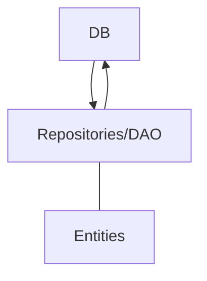
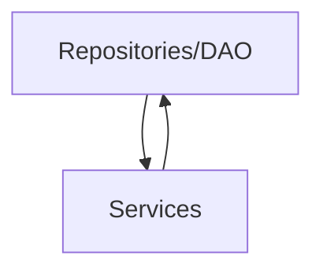
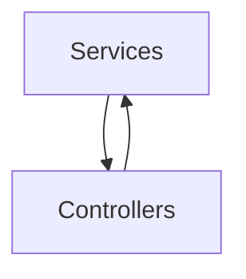

](url))# **Specification file : Song Management API**

**Authors (Group 54)**:
- Oprea, Valentin (s3906701)
- Sikorski, Vitalii (s5622360)

**Version**: 2.0  
**Date**: 18/10/2024

## Table of Contents
1. [Overview](#1-overview)
2. [Database Schema](#2-database-schema)
3. [Endpoints](#3-endpoints)
   - [GET Requests](#31-get-requests)
   - [PUT Requests](#32-put-requests)
   - [POST Requests](#33-post-requests)
   - [DELETE Requests](#34-delete-requests)
4. [Design](#4-design)

---

## **1. Overview**

The Song Management API specifies the URL endpoints to connect (using HTTP) to the application that manages songs records within the database. Namely, the application is able to:

- Perform Create, Read, Update and Delete operations on song entities.
- Retrieve all the reviews for a song.
- Calculate the average rating of a song.

## **2. Database Schema**

### Song 
| Song attributes |
| ------ |
| **id:** INT _primary_ |
| **name:** VARCHAR(255) |
| **artist:** VARCHAR(255) |
| **genre:** VARCHAR(255) |
| **album_id:** INT _foreign_ |
| **description:** VARCHAR(2048) |
| **duration:** INT |
| **released_on:** DATE |
| **added_on:** TIMESTAMP |
| **updated_on:** TIMESTAMP |

- **ID**: Unique identifier of the song
- **Name**: The name of the song
- **Artist**: The full name of the song's composer
- **Genre**: The genre of the song
- **Album ID**: Reference to the album the song is part of
- **Description**: Brief Description of the song
- **Duration**: The duration (in seconds) of the song
- **Released On:** The date (DD/MM/YYYY format) the song was released
- **Added On:** Automatically generated timestamp of the time the song was added to the database
- **Updated On:** Automatically generated timestamp of the last time the song was updated to the database

## **3. Endpoints**

The base URI of the API is: https://localhost:443, followed by the endpoint of the desired operation. If not specified otherwise, retrieval of record(s) is done in JSON format. 

### **3.1 GET Requests**

All the GET request have an optional _limit_ parameter that is passed using the ?limit={limit} query, if not specified, the default value of 50 is inferred.

- **/songs**
    - Retrieves all the songs (most recent added ones first)

    **Response**:
    | Code | Description | Schema |
    | ---- | ----------- | ------ |
    | 200  | Successful operation | [Song](#song) |
    | 500  | Internal Server Error | None |

- **/songs/{songId}**
    - Retrieves the song that has the id matching the passed _songId_.

    **Response**:
    | Code | Description | Schema |
    | ---- | ----------- | ------ |
    | 200  | Successful operation | [Song](#song) |
    | 404  | Song not found | None |
    | 500  | Internal Server Error | None |

- **/songs/{songId}/reviews**
    - Retrieves all the reviews of the song with the id matching _songId_, ordered by latest first.

    **Response**:
    | Code | Description | Schema |
    | ---- | ----------- | ------ |
    | 200  | Successful operation | [Review](#review) |
    | 404  | Song not found | None |
    | 500  | Internal Server Error | None |

- **/songs/{songId}/rating**
    - Calculates and returns in the body, the average rating associated with the song with the id matching passed parameter _songId_.

    **Response**:
    | Code | Description | Schema |
    | ---- | ----------- | ------ |
    | 200  | Successful operation | [Rating](#rating) |
    | 404  | Song not found | None |
    | 500  | Internal Server Error | None |

- **/songs?albumId={albumId}**
    - Retrieves all the songs (ascending by release date) that are part of the album that is passed as a parameter using the _albumId_.

    **Response**:
    | Code | Description | Schema |
    | ---- | ----------- | ------ |
    | 200  | Successful operation | [Song](#song) |
    | 500  | Internal Server Error | None |

- **/songs?genre={genre}**
    - Retrieves all the songs (most recent added ones first) that have the genre attibute matching the passed _genre_ parameter (as a string).

    **Response**:
    | Code | Description | Schema |
    | ---- | ----------- | ------ |
    | 200  | Successful operation | [Song](#song) |
    | 500  | Internal Server Error | None |

- **/songs?artist={artist}**
    - Retrieves all the songs (most recent added ones first) that have the artist attibute matching the passed _artist_ parameter (as a string).

    **Response**:
    | Code | Description | Schema |
    | ---- | ----------- | ------ |
    | 200  | Successful operation | [Song](#song) |
    | 500  | Internal Server Error | None |

- **/songs?name={name}**
    - Retrieves all the songs (most recent added ones first) that have the name attibute matching the passed _name_ parameter (as a string).

    **Response**:
    | Code | Description | Schema |
    | ---- | ----------- | ------ |
    | 200  | Successful operation | [Song](#song) |
    | 500  | Internal Server Error | None |

- **/songs?year={year}**
    - Retrieves all the songs (earliest ones first) that have been released on the _year_ that is passed as a parameter.

    **Response**:
    | Code | Description | Schema |
    | ---- | ----------- | ------ |
    | 200  | Successful operation | [Song](#song) |
    | 500  | Internal Server Error | None |

- **/songs?albumId={albumId}?genre={genre}**
    - Retrieves all the songs that have the album id matching the passed _albumId_ and the genre matching the passed _genre

    **Response**:
    | Code | Description | Schema |
    | ---- | ----------- | ------ |
    | 200  | Successful operation | [Song](#song) |
    | 500  | Internal Server Error | None |

- **/songs?albumId={albumId}?name={name}**
    - Retrieves the song with the specified _name_ from the album with the id _albumId_

    **Response**:
    | Code | Description | Schema |
    | ---- | ----------- | ------ |
    | 200  | Successful operation | [Song](#song) |
    | 500  | Internal Server Error | None |

- **/songs?artist={artist}?genre={genre}**
    - Retrieves the songs with the specified _genre_ from the specified _artist_

    **Response**:
    | Code | Description | Schema |
    | ---- | ----------- | ------ |
    | 200  | Successful operation | [Song](#song) |
    | 500  | Internal Server Error | None |

- **/songs?artist={artist}?name={name}**
    - Retrieves the song with the specified _name_ from the specified _artist_

    **Response**:
    | Code | Description | Schema |
    | ---- | ----------- | ------ |
    | 200  | Successful operation | [Song](#song) |
    | 500  | Internal Server Error | None |

- **/songs?year={year}?genre={genre}**
    - Retrieves the with the specified _genre_ that were released on the _year_ that is passed as a parameter.

  **Response**:
  | Code | Description | Schema |
  | ---- | ----------- | ------ |
  | 200  | Successful operation | [Song](#song) |
  | 500  | Internal Server Error | None |

### **3.2 PUT Requests**

- **/book/update?id={id}** 
  - Updates the song with the _id_ that is passed as parameter.
  - The body of the request includes an object with all the attributes of the song record (with the expection of: id, added_on, released_on).
  - If the payload fails to populate all the aforementioned fields, the response will indicate a bad request.
  - The added_on attribute remains the same and cannot be changed and updated_on is updated accordingly.

### **3.3 POST Requests**

- **/song/add**
    - Adds a new song to the repository. Alongside the request, the JSON payload of the song entity needs to be provided in the body. 
    - ID, added_on and updated_on are prepopulated. 
    - The ID of the newly created song is returned in the body of the response, as well as a message indicating the operation status (as a JSON object).

  **Responses**:
  | Code | Description | Schema |
  | ---- | ----------- | ------ |
  | 201  | Created successfully | [Song](#song) |
  | 400  | Bad Request | None |
  | 500  | Internal Server Error | None |

### **3.4 DELETE Requests**

- **/song/remove?id={id}** 
  - Removes the song with the specified _id_

  **Responses**:
  | Code | Description | Schema |
  | ---- | ----------- | ------ |
  | 200  | Successfully removed | None |
  | 404  | Song not found | None |
  | 500  | Internal Server Error | None |

### **3.4 PATCH Requests**

- **/song/update?id={id}** 
  - The body of the request includes the fields that need to be updated.
  - Trying to update the added_on, updated_on, id or rating will result in a bad request response.

  **Response**:
    | Code | Description | Schema |
    | ---- | ----------- | ------ |
    | 200  | Successfully updated | [Song](#song) |
    | 400  | Bad Request | None |
    | 404  | Song not found | None |
    | 500  | Internal Server Error | None |

## **4. Design**

The system follows the Spring Boot Application and Restful API principles.

